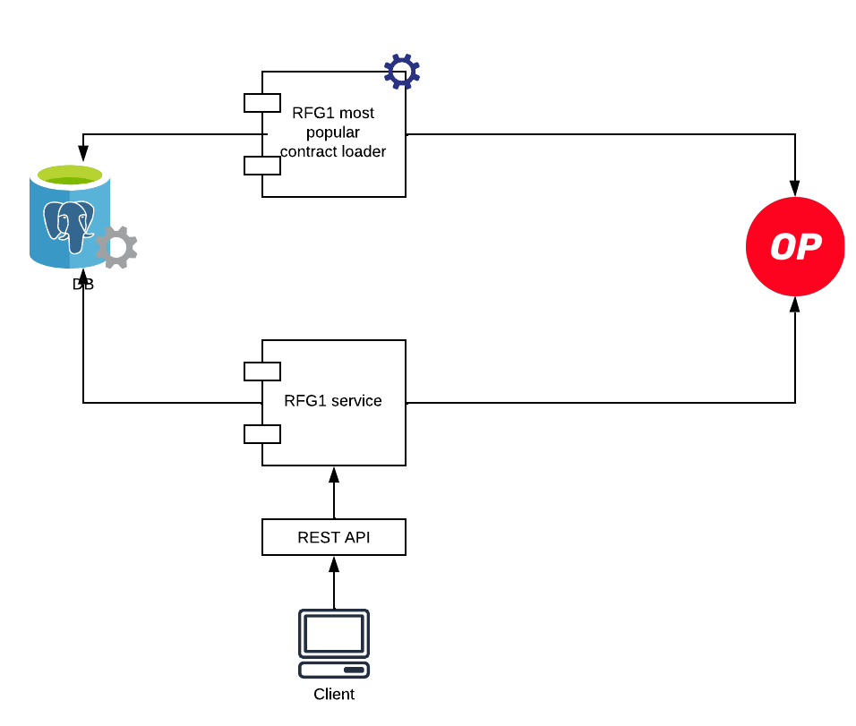
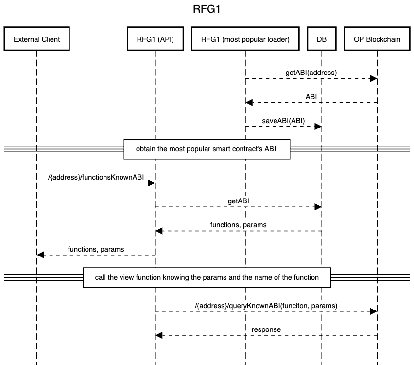
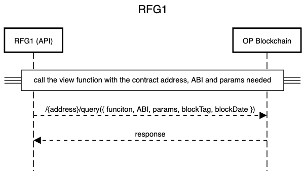
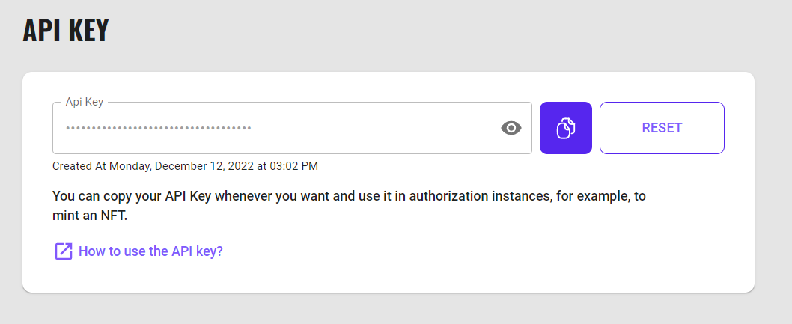

# RFG1 - Optimism Grants Council - WakeUp Labs

Welcome to WakeUp Labs' implementation of RFG1 from the Optimism Grants Council! Our service allows you to query the blockchain for specific past moments. Here's how you can get started:

## Introduction

Learn more about **WakeUp Labs** [here](https://www.wakeuplabs.io/) and explore our implementation of the Optimism **Request For Grants #1** [RFG1](https://app.charmverse.io/op-grants/page-8928491436774362) from the Optimism Grants Council. Our service is fully open-source with an MIT license.

## How to run

### Local Setup Guide

#### Prerequisites
- Node.js installed on your machine
- Git installed for cloning the repository
- PostgreSQL installed and running or any database deployed

#### Steps to Run Locally
  1. Clone the repository:
```bash
 git clone https://github.com/WakeUpLabs/RFG1-Optimism-Project.git
```

  2. Complete the environment variables in a ```.env``` file

  ```
    URL=
    PORT=
    RPC_TESTNET_URL=
    RPC_MAINNET_URL=
    DATABASE_URL=
  ```
  - URL: The base URL for the application. If you want to run it locally, it will be set to http://localhost.
  - PORT: Specifies the port number on which the server will listen for incoming requests.
  - RPC_URL: Refers to the Remote Procedure Call (RPC) endpoint for connecting to the Optimism blockchain. This variable is crucial for interacting with the blockchain, fetching data, or executing transactions.
  - PRIVATE_KEY: Represents the private key used for authentication or signing transactions. Ensure that this key is kept confidential and not shared publicly.
  - DATABASE_URL: Specifies the URL for connecting to the PostgreSQL database.

3. Run database migrations:
```bash
 npm run migrate
```
4. Install dependencies:

```bash
 npm install
``` 

5. Start the local server:

```bash
 npm run start
``` 


## Our architecture

Our service is designed for easy integration, streamlined maintenance, and adaptable extensibility with external services.



This RESTful API seamlessly interacts with the OP blockchain, persisting invoked functions in a dedicated database. Subsequently, users can conveniently bypass providing ABI information on following interactions.

Moreover, an additional [component](https://github.com/wakeuplabs/rfg1-popular-contracts-loader) empowers project owners to populate the database with smart contracts they deem pertinent.

---

To grasp the full spectrum of possibilities, delve into our sequence diagrams:

This diagram shows how to leverage pre-loaded contracts. In that way, the user could check which are those contracts considered most popular and avoid the need to manually load the ABI information.



Nevertheless, users always have the option to inspect any contract using a generic endpoint by passing the necessary parameters.




## Try It Out - Quick Demo
Sometimes, examples speak louder than words.

We've also coded the first implementation of these APIs.
The main idea behind the integration is to provide a user-friendly UI where users can define a specific Address or ENS and determine the amount of OP tokens it holds on a specific date on the Optimism Blockchain.

Try it out here: https://rfg1-demo.wakeuplabs.link/


## Try It Out - Dedicated Instance
For your convenience, WakeUp Labs offers an easier solution by providing a deployed version and dedicated instance that is ready to use and seamlessly integrates with your services via REST APIs. To get started, simply log in to the [WakeUp Platform](https://platform.wakeuplabs.io/) and obtain your free apikey.

### Integration via WakeUp Platform REST APIs

#### 1. Sign Up & Get Free API Key

To use the service, you need to [sign up](https://platform.wakeuplabs.io/) and create a free API key with your email account. 

Once you have completed the registration process, go to the API Key section to view your API key information. 



Copy the generated API key and keep it safe, as it will be your credential for accessing our services 🔐


#### 2. Use the REST API

You can explore the service's capabilities in the [WakeUp Platform API Docs](https://wakeuplabs.stoplight.io/docs/stoplight-platform/19iod9xapzajp-rfg-1-optimism-grants-council-wake-up-labs)


Follow the instructions to use the REST API as you please.
These are some API endpoints you will find and be able to use to try RFG1 implementation:

* [Healthcheck Endpoint:](https://wakeuplabs.stoplight.io/docs/stoplight-platform/jbhm9uyfok2dt-healthcheck-endpoint) Check the health status of the service.
* [Retrieve Wallet Balance:](https://wakeuplabs.stoplight.io/docs/stoplight-platform/zst7kbmqxuxgp-retrieve-wallet-balance) Retrieve the current balance of a wallet.
* [Retrieve Wallet Balance at Block:](https://wakeuplabs.stoplight.io/docs/stoplight-platform/kqng1cecb32qx-retrieve-wallet-balance-at-block) Get the wallet balance at a specific block in the past.
* [Retrieve Wallet Balance at Date](https://wakeuplabs.stoplight.io/docs/stoplight-platform/vj8jtm9fbdl0n-retrieve-wallet-balance-at-date): Fetch the wallet balance at a specific date in the past.
* [Execute Contract Function:](https://wakeuplabs.stoplight.io/docs/stoplight-platform/ugoyma40tq7jm-execute-contract-function) Execute a contract ```public view``` function to get historical data, by input of ABI.
* [Execute Known Contract Function:](https://wakeuplabs.stoplight.io/docs/stoplight-platform/by55d5fnj48cl-execute-known-contract-function) Execute a ```public view``` function of a known contract to get historical data, no ABI input needed.
* [Get View Functions of Known Contracts:](https://wakeuplabs.stoplight.io/docs/stoplight-platform/dctukth2fct7k-get-a-functions-known-abi) List ```public view``` functions of known contracts.
* [Get most popular smart contracts:](https://wakeuplabs.stoplight.io/docs/stoplight-platform/1kjq0rkc09qt7-get-most-popular-smart-contracts) List ```contract addresses``` of the most popular contracts loaded previously.
